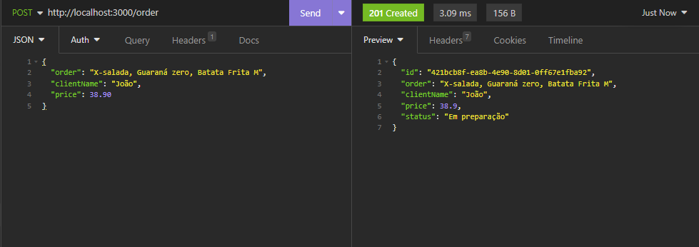
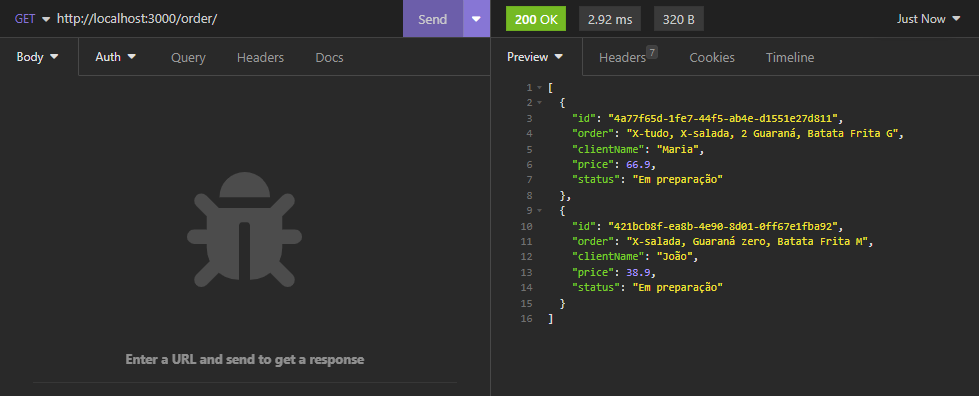
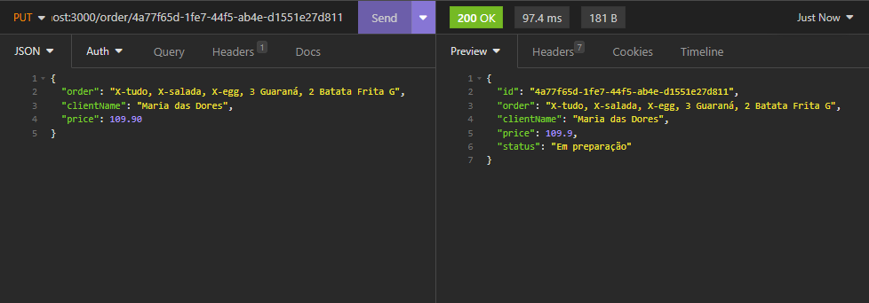
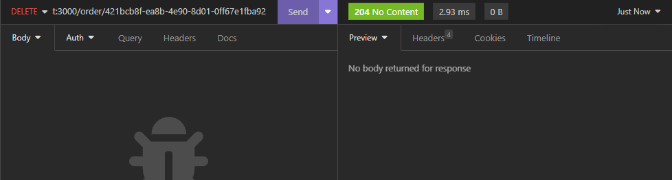
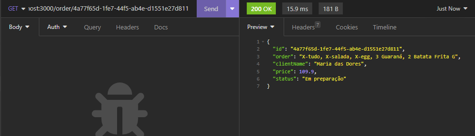
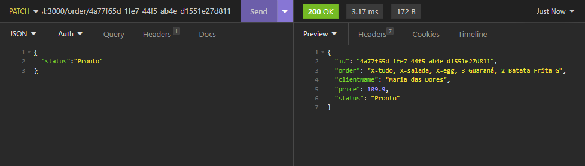

# API Hamburgueria 🍔
API feita para gerenciar pedidos de clientes.

O projeto foi desenvolvido para cumprir o desafio final do módulo de Node.js da formação Full Stack PRO do DevClub.

## O desafio
Crie uma aplicação que fará o cadastro dos pedidos de uma hamburgueria, e você deve utilizar [Node](https://nodejs.org/en/) e [Express](https://expressjs.com/pt-br/).

### Rotas
- `POST /order`: A rota deve receber o `pedido do cliente`, o `nome do cliente` e `o valor do pedido`, essas informações devem ser passadas dentro do corpo(body) da requisição, e com essas informações você deve registrar o novo pedido dentro de um array no seguinte formato: `{ id: "ac3ebf68-e0ad-4c1d-9822-ff1b849589a8", order: "X- Salada, 2 batatas grandes, 1 coca-cola", clientName:"José", price: 44.50, status:"Em preparação" }`. Não se esqueça que o ID deve ser gerado por você, dentro do código utilizando UUID V4, assim que o pedido é criado, você deve sempre colocar o status como "Em preparação".

- `GET /order`: Rota que lista todos os pedidos já feitos.

- `PUT /order/:id`: Essa rota deve alterar um pedido já feito. Pode alterar,um ou todos os dados do pedido.O `id` do pedido deve ser enviado nos parâmetros da rota.

- `DELETE /order/:id`: Essa rota deve deletar um pedido já feito com o `id` enviado nos parâmetros da rota.

- `GET /order/:id`: Essa rota recebe o `id` nos parâmetros e deve retornar um pedido específico.

- `PATCH /order/:id`: Essa rota recebe o `id` nos parâmetros e assim que ela for chamada, deve alterar o status do pedido recebido pelo id para "Pronto".

## Screenshots
### Screen da rota de criar o pedido do clinte

### Screen da rota de listar todos os pedidos

### Screen da rota de alterar um pedido já feito

### Screen da rota de deletar um pedido já feito

### Screen da rota de listar um pedido pelo id

### Screen da rota de alterar o status do pedido

## 🛠️ Tecnologias
- JavaScript
- Node.js
- Express

## 💙 Contato
Criado por João Oliveira

